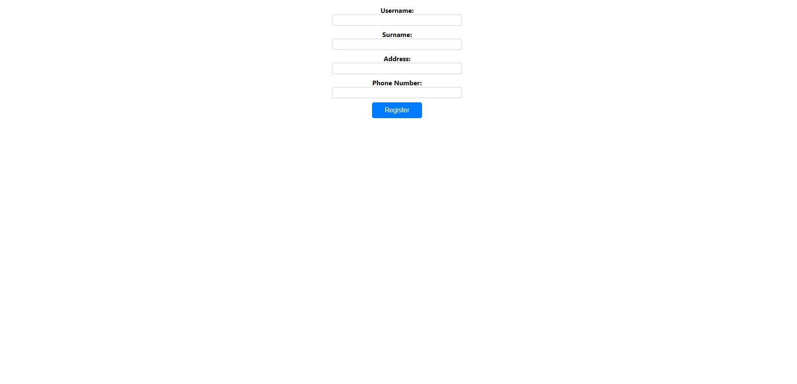
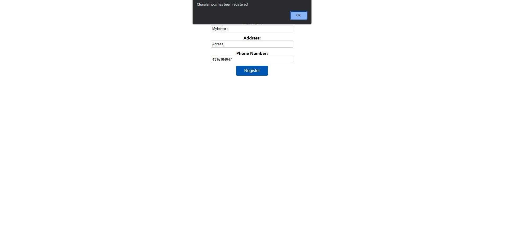
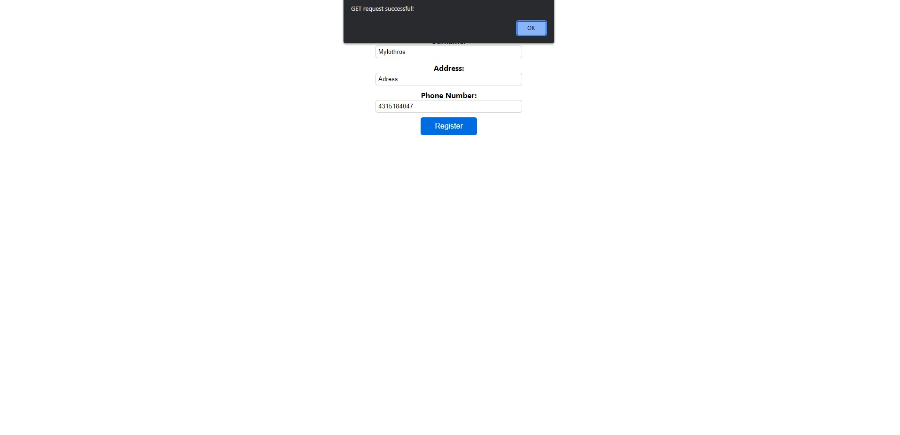
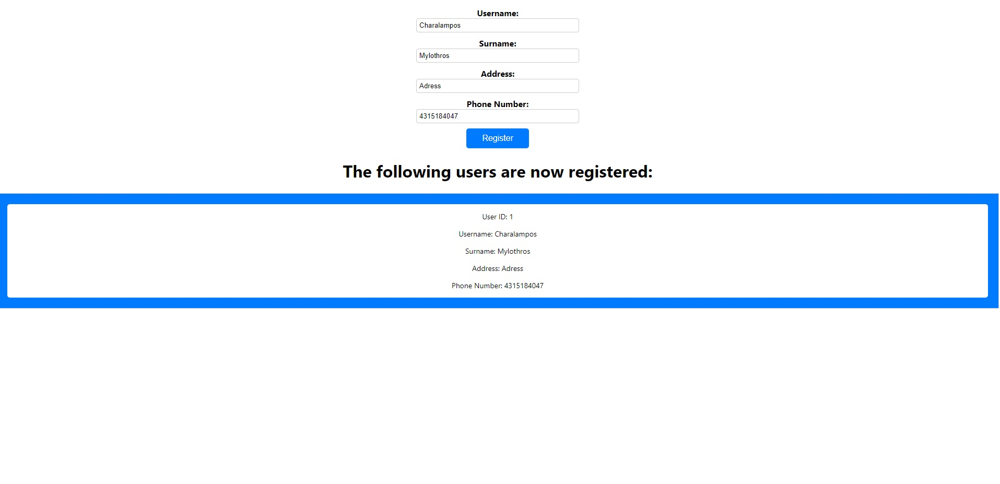
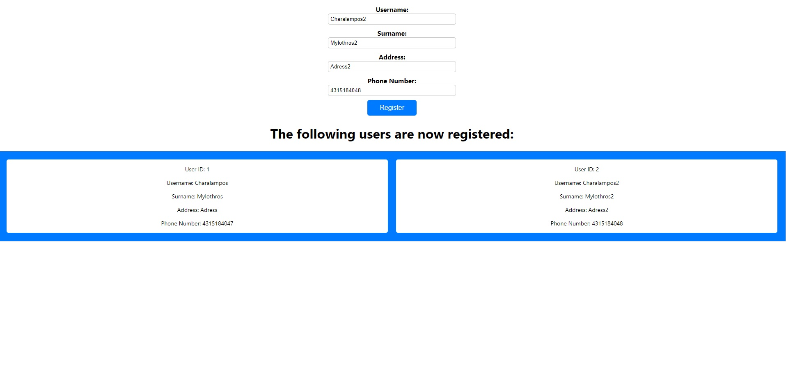

# Register Form

This project implements a register form application that allows users to register by providing their username, surname, address, and phone number. The backend of the application is built using Spring Boot with Hibernate and JPA, which handles the database operations for user registration and retrieval. The frontend is developed using React.js, providing a simple and intuitive user interface for registering users and displaying the registered users.

## Table of Contents

- [Homepage](#homepage)
- [Tools and Technologies Used](#tools-and-technologies-used)
- [Installation and Setup](#installation-and-setup)
- [Presentation](#presentation)

## Homepage

- User Registration: Users can fill in the registration form with their details, including username, surname, address, and phone number. The form validates the mandatory fields and displays appropriate error messages if any field is missing.

- Backend Data Storage: The backend uses Hibernate and JPA to create and manage a database table for storing user information. When a user registers, their details are stored in the database using a POST request.

- GET Request: After successful registration, the frontend makes a GET request to retrieve the list of all registered users from the backend. The retrieved user data is then displayed on the frontend.

## Tools and Technologies Used

- Backend:
  - Java
  - Spring Boot
  - Hibernate
  - JPA
  - IntelliJ IDEA

- Frontend:
  - JavaScript
  - React.js
  - Visual Studio Code

## Installation and Setup

To run the project locally, follow these steps:

1. Clone the repository to your local machine.

2. Backend Setup:
   - Open the `RegisterForm` folder in IntelliJ IDEA.
   - Configure the database connection properties in the `application.properties` file.
   - Run the Spring Boot application to start the backend server.

3. Frontend Setup:
   - Open the `frontend` folder in Visual Studio Code or any compatible code editor.
   - Install the required dependencies by running `npm install` in the terminal.
   - Start the React development server with `npm start`.

4. Access the Application:
   - Open your web browser and visit `http://localhost:3000` to access the frontend.
   - The register form will be displayed, allowing you to enter user details and register.
   - After registration, the list of registered users will be shown.

5. Backend API Endpoints:
   - POST Request: `http://localhost:8085/api/v1/user/save`
     - Sends user registration data to the backend for storage in the database.
   - GET Request: `http://localhost:8085/api/v1/user/get`
     - Retrieves the list of all registered users from the backend.

## Presentation

